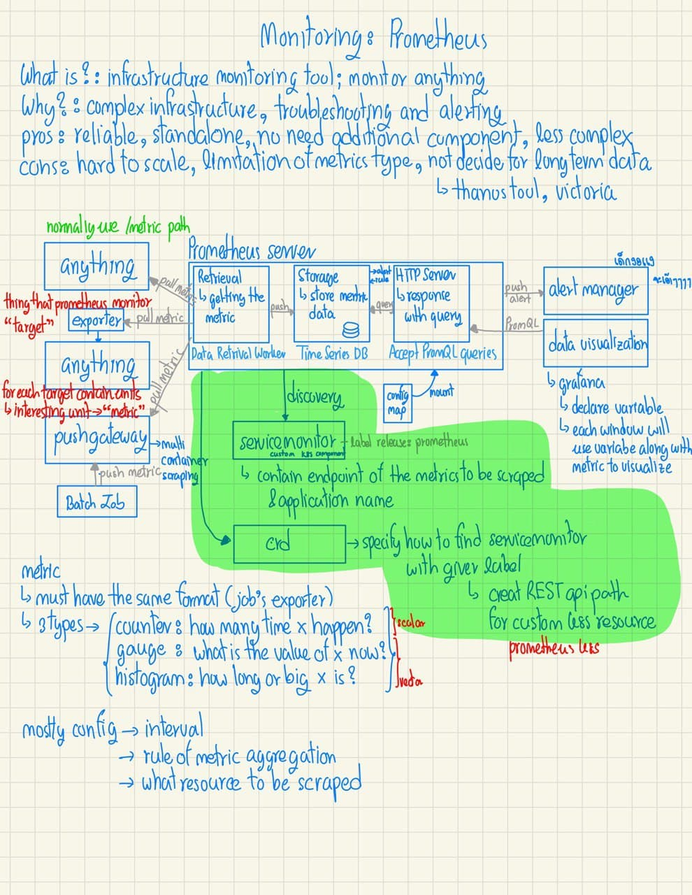
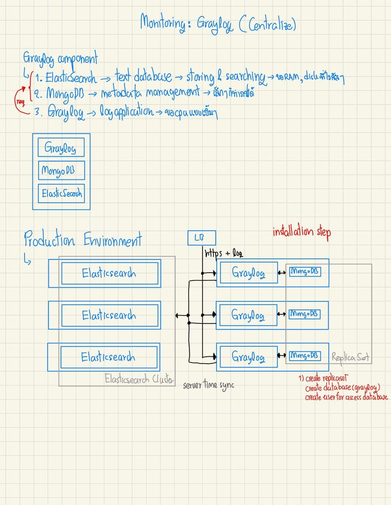
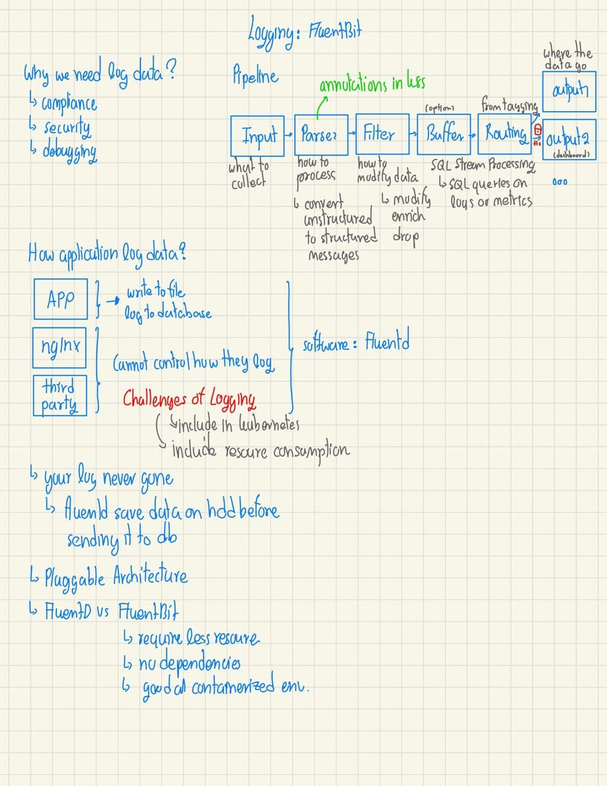

### Folder structure

We keep media file in media/... 

Each folder contains 2 file naming convention is

1. photo.jpg
2. file.goodnotes

---

find incomplete coming soon section by "coming soon"

---

# DevSecOps

[coming soon]

## 12 Factor Apps Methodology

12 Factor เป็นวิธีการสร้าง Software as a service (SaaS)

- การใช้ declarative สำหรับการทำ automation
- ระบุ OS, Environment ที่ใช้งาน
- หลักเลี่ยงการใช้งาน System administrator
- ลดความต่างระหว่าง Environment เพื่อทำให้การทำ Continuous deployment ทำได้ง่ายขึ้น
- ทำให้สามารถ Scale ได้ง่ายโดยไม่ต้องเปลี่ยนรูปแบบการทำงานของระบบอื่น ๆ

ขอบคุณที่มา [12Factor](https://12factor.net/)

### 1. Codebase

`One codebase tracked in revision control, many deploys`

App ที่ใช้หลักการ 12 Factor จะเก็บ source code ไว้ใน version control system เสมอจะเรียกรวมกันว่า "repo"

Codebase คือ 1 repo หรืออะไรก็ตามที่ใช้ root commit ร่วมกัน

```conf
/-----------\               DEPLOY = instance of application
|           |         /----------------\
|           | ------> |   PRODUCTION   |
|  CODEBASE |         \----------------/
|           |         /----------------\
|           | ------> |     STAGING    |
\-----------/         \----------------/
            \         /----------------\
             \------> |   DEVELOPER1   |
                      \----------------/
```

ความสัมพันธ์ของ Codebase กับ Application มีดังนี้
- ถ้ามีมีหลาย Codebase สิ่งนั้นคือ Distributed system และแต่ละ Codebase คือ Application
- Application ใช้ code ชุดเดียวกันสิ่งนั้นละเมิดต่อ 12 Factor ทางออกก็คือการทำ library กลางที่แต่ละ Application จะมาเรียกใช้งาน (Dependency manager)

### 2. Dependencies

`Explicitly declare and isolate dependencies`

Application ที่ใช้ 12 Factor จะไม่ใช้งานตัว System-side package (ของที่อยู่บนเครื่อง) แต่จะใช้งานแค่ตัวที่ถูกกำหนดไว้ใน Dependency declaration manifest ของมันและจะใช้งานร่วมกันกับ Dependency isolation tool ระหว่างการทำงานใน Deploy ต่าง ๆ

ประโยชน์ของการทำ Explicit depencdency คือการที่ developer คนใหม่เข้ามาใช้งานและตั้งค่าต่อได้ง่ายขึ้น โดยต้องการแค่ภาษาและ Depencency mamager และทำการ set up ด้วยคำสั่ง `build command` (pip install -r <file.txt>) 

### 3. Config

`Store config in the environment`

Application config คือของที่จะแตกต่างกันระหว่าง deploy ต่าง ๆ เช่น Staging, production
- database, memcached, [backing services](###4.-Backing-services)
- credential ที่ใช้สำหรับ 3rd party
- per-deploy หรือค่าที่ใช้ในการแยก deploy {dev, uat, pre-prod, prod} แต่ละชนิดออกจากกันเช่น hostname

การเก็บ Config ของ Application ไว้แบบค่าคงที่อย่าหาทำให้กำหนดไว้แยกกันหรือเก็บไว้ใน Config แยกที่ไม่ถูกเก็บใน Revision control ในรูปแบบของ Environment

ทำให้สามารถกำหนดค่าแยกกันแต่ละ Deploy ได้โดยไม่ต้องเปลี่ยน Code

### 4. Backing services

`Treat backing services as attached resources`

```conf
                /----------------\
                |   PRODUCTION   |
                \----------------/
                /                \
               / Backing Services \
         _____/_____          _____\_____
        /     S3    \        / POSTGRESQL \
       |_____________|      |_____________|
```

Backing services คือของที่ application เราใช้งานผ่าน network และเป็นส่วนหนึ่งของการทำงานของ app 
- Datastore ex. MySQL, CouchDB
- Messaging/queueing ex. RabbitMQ, Beanstalkd
- Email ex. Postfix
- Caching systems ex Memcached

backing services อาจจะใช้งานทั้ง locally-managed services หรือไปใช้งาน 3rd party app ได้เหมือนกันเช่น Amazon S3 หรือพวก API-accessible consumer ex. Twitter, Google map

หลักการของ 12 Factors ก็คือ application ของเราจะไม่มีการเปลี่ยนแปลง (code)เมื่อย้ายการใช้งานระหว่าง third-party กับ local services

เช่น พวก URL, credential จะถูกแก้ไขผ่าน [Config](###3.-Config) เท่านั้น

เราจะมอง Backing services เป็น resource ต่อ 1 service ของมัน 12 Factors มอง resource เหล่านี้ว่าเป็นของที่มา attached (เกี่ยว) สามารถเปลี่ยนเมื่อไหรก็ได้ -> loose coupling

### 5. Build, release, run

`Strictly separate build and run stages`

```conf
/-----------\               DEPLOY = instance of application
|           |   v1    |----------------\
|           | ------> |      BUILD     |         ___________
|  CODEBASE |         |________________| \      |           |
|           |                             ├────>|  RELEASE  |
|           |                            /      |___________|
\-----------/         |----------------\
                      |     CONFIG     |
                      |________________|
```

[Codebase](###1.-Codebase) ถูกเปลี่ยนไปเป็น non-development deploy ด้วย 3 ขั้นตอน
1. `build stage` การเอา code repo ณเวอร์ชั่นที่กำหนดมา build (compile dependency)
2. `release stage` เอาของที่ได้จาก build stage มารวมกับ config ของ deploy ทำให้สามารถใช้งานได้
3. `run stage` หรือเรียกอีกชื่อว่า runtime stage

พวก Tool ที่เกี่ยวข้องกับการ Deployment มักจะมี Release management tools ติดมาด้วยเพื่อให้สามารถทำการ Rollback กลับไปยัง version ก่อนหน้าได้ง่ายขึ้น

แต่ละ Release ของมี ID + Timestamp เป็นของตัวเอง จะไม่มีการแก้ไข Release นั้น ๆ แต่จะเป็นการปล่อย Release (แก้ code แหละ) ที่แก้ไขแล้วออกมาแทน

### 6. Processes

`Execute the app as one or more stateless processes`

Application ที่ถูกเขียนด้วย 12 Factor จะเป็น stateless process และไม่มีการใช้งานร่วมกันเช่น memory หรือ storage กับ process อื่นโดยข้อมูลที่จะต้องจัดเก็บและเรียกใช้งานทีหลังจะถูกเก็[ไว้ใน [Backing service](###4.-Backing-services)

Memory space, file system สามารถถูกใช้งานได้แปปหนึ่ง (cache) แต่ 12 Factor นั้นมองว่าของที่ cache เหล่านั้นหน่ะเดี่ยวแม่งก็หายไปในอนาคตเผลอ ๆ process ที่ทำงานอยู่นี้เองแหละที่จะหายไปจาก computer เครื่องนี้อาจจะไปอยู่บน node อื่นแทน

เช่น พวกที่ rely on session แบบ user ต้องถูก route กลับมาที่เก่า (process) ไรงี้ก็หาที่เก็บ Session state เช่นพวก Redis, memcachhed แทนก็ได้

### 7. Port binding

`Export services via port binding`

ในการ Deploymeny จะมีการ routing ตัว public-facing hostname ไปยัง port ของ web server ที่ทำงานอยู่ข้างในอีกที ทำให้ Application หนึ่งสามารถกลายเป็น Backing service ของอีก Application หนึ่งได้เลย

### 8. Concurrency

`Scale out via the process model`

Web application มีหลายรูปแบบมากในการทำงานเช่น PHP อาจจะทำงานเป็น Child process ของ Apache webserver อีกทีขยายเพิ่มหรือลดตามความต้องการใช้งานของ Application นั้น ๆ, JAVA จะจองทรัพยากรเป็นก้อนในขณะที่ทำการ start up ตัวเอง --> ในมุมมอง Dev ก็คือ 1 Application

การนำ [Unix process model](https://adam.herokuapp.com/past/2011/5/9/applying_the_unix_process_model_to_web_apps/) มาใช้กับ Web application จะมี 2 อย่างที่ควรรู้คือ
1. Process type: ชนิดของ process เอาไว้แยกการทำงาน "Class" ก็ได้ใน OOP เช่น web ก็มีหน้าที่สำหรับการจัดการ HTTP request ที่เข้ามา
2. Process: ตัวงานที่มีอยู่จริงหรือ (Instance of class) ใน OOP

```conf
          Scale
    (Running Process)       
            A
            |
            |
            |.____________.
            ||            |
            ||  web app 2 |
            ||____________|
            |.____________. .____________.
            ||            | |            |
            ||  web app 1 | |   worker1  |
            ||____________| |____________|
            └────────────────────────────────────────> Workload diversity
                   web          worker         ...       (Process Type)
web:          bundle exec ruby web.rb -p $PORT
fastworker:   QUEUE=urgent bundle exec rake resque:work
# Declare the process type ad
```

Application ที่ทำตาม 12 Factor จะไม่เขียน PID ไฟล์แต่จะใช้งานตัว OS process manager (systemd, foreman)

### 9. Disposability

`Maximize robustness with fast startup and graceful shutdown`

Application ที่ใช้ 12 Factor ตัว Process นั้นจะสามารถใช้แล่้วทิ้งได้ (Statless Application) ทำให้สามารถใช้ความสามารถในการ Scaling ได้อย่างสุดยอด

Process ต้องปิดตัวอย่างสมบูรณ์เหมือนได้รับ SIGTERM จาก Process manager สำหรับ Web server จะหมายถึงการทำงานของ Request หนึ่งเสร็จพอดีและก็จบการทำงาน

จะมีการใช้งาน Message queue มาร่วมด้วย ก็คือ Worker process นั้นจะทำงานเสร็จสมบูรณ์ก็ต่อเมื่อคืน Job กลับสู่ Message queue ที่ใช้งานอยู่ ทำให้เรามั่นใจได้ว่าทุก Request ที่ส่งเข้ามานั้นสามารถตอบกลับได้หมด

อันนี้ไม่ชัว:: ก็คือถ้ามันทำงานไม่สมบูรณ์มันจะส่ง NACK กลับและ job จะ return สู่ message queue โดยอัติโนมัติ

### 10. Dev/prod parity

`Keep development, staging, and production as similar as possible`

ในอดีตความต่างกันระหว่าง Deploy จะถูกแบ่งออกเป็นประมาณ 3 อย่าง
- Time gap: developer เขียน Code ก็ Update ได้บ่อยซึ่งต่างจากตัว Production Environment ที่นาน ๆ ทีจะมีการ Update code
- Personnel gap: developer เขียน Ops deploy
- Tool gap: ในเครื่องของ Dev เองอาจจะใช้ Nginx, SQLite, OS X แต่เมื่ออยู่บน Production deploy อาจจะใช้งาน Apache, MYSQL, Ubuntu แทนก็เป็นได้

12 Factor ถูกออกแบบมาเพื่อให้เกิด Continuous deployment โดยทำให้ gap ข้างต้นนั้นลดลงน้อยที่สุด
- เขียนเสร็จ Deploy ได้เลย
- Dev เขียนเสร็จดูคุณภาพของงานได้เลย
- ทำให้เครื่องมือของ Developer environment และ Production environment นั้นเหมือนกันมากที่สุด

### 11. Logs

`Treat logs as event streams`

อธิบายการทำงานของ Application 1 เหตุการณ์ที่เกินขึ้นมีเวลามีคำอธิบายว่าเกิดอะไรขึ้น ไปเรื่อย ๆ ตลอดการทำงานของ Application 

การทำงานของ Application กับ Logs ที่ใช้งานร่วมกับ 12 Factor ก็คือไม่ต้องสนว่า Logs นั้นจะถูกจัดการหรือทำ Buffer แล้วส่งไปที่ไหน Application แค่พ้น Logs ออกมาก็พอ `stdout`

จะมีตัวมาจัดการกับ Logs และนำไปเก็บยังที่ ๆ ใช้จัดเก็บเองเช่นพวก FluentD

### 12. Admin processes

`Run admin/management tasks as one-off processes`

เป็นพวกการทำงานที่สั่งแค่ครั้งเดียวสำหรับให้ Application นั้น ๆ เช่น `python manage.py makemigrations` ก็ทำการ migrate ตัว database

## Day0, 1, 2 operation

### Day0 น่าเบื่อ แต่สำคัญ

เป็นช่วงต้นของ project ที่ใช้ในการออกแบบและ design ทั้ง software และ architecture

เป็นขั้นตอนที่น่าเบื่อแต่ความสำเร็จของ project ก็ขึ้นอยู่กับขั้นตอนนี้

วางแผนการใช้ CPU, RAM, disk แต่ถ้าบน cloud ทำให้ความผิดพลาดในการคาดการณ์การใช้งานสิ่งเหล่านี้เป็นความผิดที่รุนแรงน้อยลงได้ เพราะสามารถปรับเปลี่ยนได้ในบางเวลา

### Day1 สิ่งต่าง ๆ ถูกสรรสร้าง

เกี่ยวกับพัฒนาและ deploy software ที่ถูกออกแบบบน Day0 และพวก Infrastructure ที่เกี่ยวกับมัน

### Day2

เริ่มทำการ monitoring ตัวระบบต่าง ๆ รวมทั้ง software การเก็บ Metrics, Logs, Tracing <- (Application performance monitoring (APM)) 

// ที่ทำโปรเจ็คจบไปคือรวม Day2 ไปด้วยแต่เข้าใจผิดว่ามันคือ Day1

# CI/CD Tools

## Jenkins

### Single page version


# Monitoring

## Observability

1. Metrics
2. Logs
3. Traces
4. Alert

## Metrics

### Prometheus

- Single page version

    

## Logs

### Graylog

- Single page version

    

- Installation

    [README](./installation/monitoring/graylog/README.md)

- Upgrade or downgrade

    [README](./installation/monitoring/graylog/upgrade.md)

- Recommendation

    ้heap memory -> more heap can use for filter and cacheing -> increate query performance

    os file cache -> keep the hot segments resident in memory -> access faster

    recommendtation = 50%(max(RAM))[elasticsearch] + 50%(max(RAM))[free]

    ```bash
    export ES_HEAP_SIZE=10g
    # or
    ES_JAVA_OPTS="-Xms10g -Xmx10g" ./bin/elasticsearch
    # not more than 32 JVM cannot point above address
    ```

### FluentBit

- Single page version

    

## Traces

[coming soon]

# Deployment

## 4 Types of deployment

### 1. Blue-Green Deployment

เมื่อ deploy ของใหม่ขึ้นไปครบแล้วจะยังไม่ลบของเก่าแต่จะเก็บไว้ก่อน แล้ว route traffic ไปยังของใหม่ทั้งหมด หากเกิดปัญหาก็สามารถ route traffic กลับมาเวอร์ชั่นก่อนหน้าได้เลย

### 2. Canary Release

เป็นอีกขั้นของ Blue-Green Deployment ก็ว่าได้แต่จุดประสงค์ก็คือเพื่อทดลอง feature กับ user เพียงบางกลุ่มเท่านั้น ถ้าจะทำได้ก็อาจจะเริ่มตั้งแต่ design app เลยก็ได้ หรืออาจจะใช้งานร่วมกันกับ Feature Toggle ก็ได้

เกือบเหมือนกับ A/B Testing แต่ Canary Release เนี่ยใช้เพื่อป้องกันไม่ให้เกิดปัญหากับคนส่วนใหญ่มากกว่า ส่วน A/B ก็ตามจุดประสงค์ของ A/B ถ้าจำไม่ผิดคือการดูว่า user ชอบแบบไหนมากกว่ากัน

### 3. Feature Toggles

อาศัยการออกแบบ application เข้าช่วยคือ user คนไหนสมัครใจเปิดใช้งาน feature ใหม่ก็ไปเปิด โดยจะแบ่งรูปแบบเป็น 4 ประเภทด้วยกัน

1. Release Toggle
    
    การแยกการ deploy กลับการใช้งานออกจากกัน เช่น feature นี้ปล่อยออกไปแล้วแต่ยังไม่เปิดให้ user สามารถเข้าใช้งานได้จนกว่าจะถึงเวลาที่กำหนด

2. Experiment Toggle

    เพื่อเก็บข้อมูลเป็นระยะเวลาที่ยาวนานกับ user บางกลุ่มเท่านั้น

3. Ops Toggle

    ถ้ามี feature ไหนพังก็แค่ปิดมันทิ้ง

4. Permission Toggle

    เพื่อให้ user บางกลุ่มสามารถรอง feature ใหม่ ๆ หรือพิเศษได้

### 4. Dark launches

เราจะจำลองการเทสระบบบน production ยังไงให้เสมือนจริงที่สุด นั้นแหละครับเอามันไปไว้บน production เลย

ก็คือมีเงามืดซ่อนอยู่ในระบบเช่น feature นั้นถูกใช้งานแต่ไม่ได้ถูกนำมาแสดงผลเพื่อให้ user เห็นแต่กลับใช้ feature เดิมนั้นแหละทำการตอบกลับ

ทำให้สามารถเก็บผลลัพธ์จากระบบใหม่และ feature ใหม่ได้

ทำให้ feature ของเรานั้นสามารถถูกทดลองได้แบบบน production เลย

# Git

## Git Ops

[coming soon]

## Git workflow

เป็นรูปแบบการใช้งาน version control

เมื่อเราดู ๆ ไป model มันจะคล้ายสิ่งที่เรียกว่า git flow เลยแต่อันนี้เป็นพื้นฐานว่าเราแตกแต่ละ branch ไว้ทำไม

### 1. Simple branch

มีหลาย ๆ คนช่วยกันรุมสะกำใช้งานกันในอันนี้เวลา merge ก็จะเบิ้ม ๆ หน่อย

### 2. Feature branch

มี branch ที่เพิ่มขึ้นมาก็คือ feature เวลาเพิ่มก็ใช้ feature เสร็จแล้ว merge เข้า master

เวลา feature ใหญ่เกินไป branhc feature ก็นำไปยาววววเลย

### 3. Develop branch

มี branch ที่เพิ่มเข้ามาคือ feature และ develop ก็คือจะไม่ merge เข้า master อีกต่อไปถ้า feature เสร็จ

### 4. Release branch 

เป็นตัวที่ branch เพิ่มขึ้นมาจากข้อ 3 ก็คือ release branch จุดประสงค์ของมันก็เพื่อพัก feature ที่เขียนเสร็จแล้วก่อน เพื่อทดสอบตอนมันมารวมร่างกันจริง ๆ แล้วก็ดูว่าถงจุดที่เราต้อง release ของหรือยังก็จะค่อยปล่อยทีเดียวด้วยเหตุผลทางธุรกิจด้วย

อารมณ์แบบเขียน feature เซ็นสัญญาเสร็จแล้วแต่ไม่มี feature ส่งมอบของให้กับลูกค้างี้

## Git flow

เป็น git extension 

เวลาจะเขียนโค๊ดก็จะแบ่งตัว branch ออกเป็นหลัก ๆ 5 รูปแบบ

```txt
    |        |         |          |          |
    |        |         |          |          |
    |        |         |          |          |
    |        |         |          |          |
    |        |         |          |          |
    |        |         |          |          |
 feature  develop   release    master     hotfix  
```

- feature

    เมื่ออยากสร้าง feature ใหม่ก็แตกออกจาก branch develop ออกมา ถ้าใช้งานเสร็จแล้วก็ merge กลับและลบ branch นั้นทิ้ง

- release

    เมื่อต้องการจะปล่อย feature ที่ develop ไปหนึ่งหรือหลาย ๆ อันก็จะทำการ แตก branch จาก develop ไปชื่อ release อาจจะมีการแก้ไขหรือเพิ่มการเตรียมพร้อมสำหรับ production เสร็จแล้วก็จะ merge กลับไปยัง develop และ master(แบบติด tag)

- hotfix

    ใช้สำหรับการปรับแก้สิ่งที่ไม่คาดคิดว่าจะเกิดขึ้นใน production version ก็เมื่อแก้ไขเสร็จแล้วก็จะทำการ merge กลับ master (ติด tag bugfix) และก็ develop