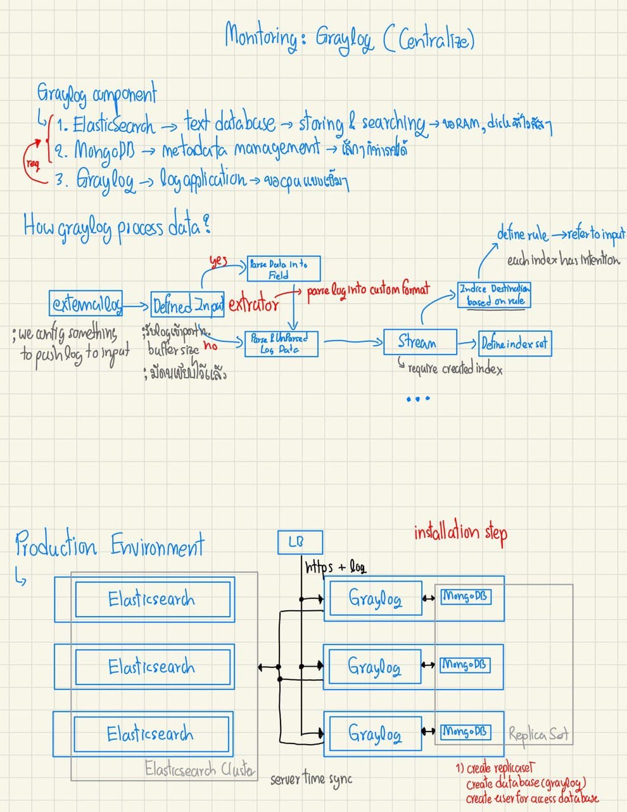

### Folder structure

we keep media file in media/... 

each folder contains 2 file naming convention is

1. photo.jpg
2. file.goodnotes

# CI/CD Tools

## Jenkins

### Single page version


# Monitoring

## Prometheus

### Single page version


## Graylog

### Single page version



### Installation

[README](./installation/monitoring/graylog/README.md)

### Upgrade or downgrade

[README](./installation/monitoring/graylog/upgrade.md)

### Recommendation

้heap memory -> more heap can use for filter and cacheing -> increate query performance

os file cache -> keep the hot segments resident in memory -> access faster

recommendtation = 50%(max(RAM))[elasticsearch] + 50%(max(RAM))[free]

```bash
export ES_HEAP_SIZE=10g
# or
ES_JAVA_OPTS="-Xms10g -Xmx10g" ./bin/elasticsearch
# not more than 32 JVM cannot point above address
```

## FluentBit

### Single page version

