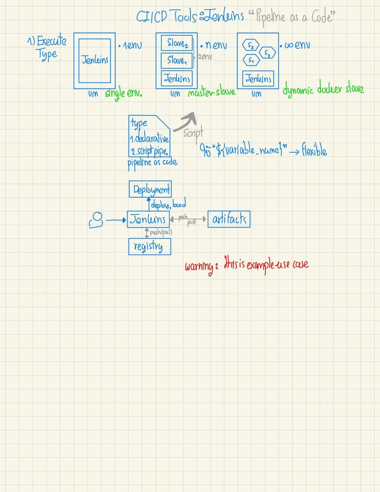

### Folder structure

we keep media file in media/... 

each folder contains 2 file naming convention is

1. photo.jpg
2. file.goodnotes

# CI/CD Tools

## Jenkins

### Single page version



# Monitoring

## Prometheus

### Single page version


## Graylog

### Single page version


### Installation

[README](./installation/monitoring/graylog/README.md)

### Upgrade or downgrade

[README](./installation/monitoring/graylog/upgrade.md)

### Recommendation

้heap memory -> more heap can use for filter and cacheing -> increate query performance

os file cache -> keep the hot segments resident in memory -> access faster

recommendtation = 50%(max(RAM))[elasticsearch] + 50%(max(RAM))[free]

```bash
export ES_HEAP_SIZE=10g
# or
ES_JAVA_OPTS="-Xms10g -Xmx10g" ./bin/elasticsearch
# not more than 32 JVM cannot point above address
```

## FluentBit

### Single page version


# Deployment

## 4 Types of deployment

### 1. Blue-Green Deployment

เมื่อ deploy ของใหม่ขึ้นไปครบแล้วจะยังไม่ลบของเก่าแต่จะเก็บไว้ก่อน แล้ว route traffic ไปยังของใหม่ทั้งหมด หากเกิดปัญหาก็สามารถ route traffic กลับมาเวอร์ชั่นก่อนหน้าได้เลย

### 2. Canary Release

เป็นอีกขั้นของ Blue-Green Deployment ก็ว่าได้แต่จุดประสงค์ก็คือเพื่อทดลอง feature กับ user เพียงบางกลุ่มเท่านั้น ถ้าจะทำได้ก็อาจจะเริ่มตั้งแต่ design app เลยก็ได้ หรืออาจจะใช้งานร่วมกันกับ Feature Toggle ก็ได้

เกือบเหมือนกับ A/B Testing แต่ Canary Release เนี่ยใช้เพื่อป้องกันไม่ให้เกิดปัญหากับคนส่วนใหญ่มากกว่า ส่วน A/B ก็ตามจุดประสงค์ของ A/B ถ้าจำไม่ผิดคือการดูว่า user ชอบแบบไหนมากกว่ากัน

### 3. Feature Toggles

อาศัยการออกแบบ application เข้าช่วยคือ user คนไหนสมัครใจเปิดใช้งาน feature ใหม่ก็ไปเปิด โดยจะแบ่งรูปแบบเป็น 4 ประเภทด้วยกัน

1. Release Toggle
    
    การแยกการ deploy กลับการใช้งานออกจากกัน เช่น feature นี้ปล่อยออกไปแล้วแต่ยังไม่เปิดให้ user สามารถเข้าใช้งานได้จนกว่าจะถึงเวลาที่กำหนด

2. Experiment Toggle

    เพื่อเก็บข้อมูลเป็นระยะเวลาที่ยาวนานกับ user บางกลุ่มเท่านั้น

3. Ops Toggle

    ถ้ามี feature ไหนพังก็แค่ปิดมันทิ้ง

4. Permission Toggle

    เพื่อให้ user บางกลุ่มสามารถรอง feature ใหม่ ๆ หรือพิเศษได้

### 4. Dark launches

เราจะจำลองการเทสระบบบน production ยังไงให้เสมือนจริงที่สุด นั้นแหละครับเอามันไปไว้บน production เลย

ก็คือมีเงามืดซ่อนอยู่ในระบบเช่น feature นั้นถูกใช้งานแต่ไม่ได้ถูกนำมาแสดงผลเพื่อให้ user เห็นแต่กลับใช้ feature เดิมนั้นแหละทำการตอบกลับ

ทำให้สามารถเก็บผลลัพธ์จากระบบใหม่และ feature ใหม่ได้

ทำให้ feature ของเรานั้นสามารถถูกทดลองได้แบบบน production เลย